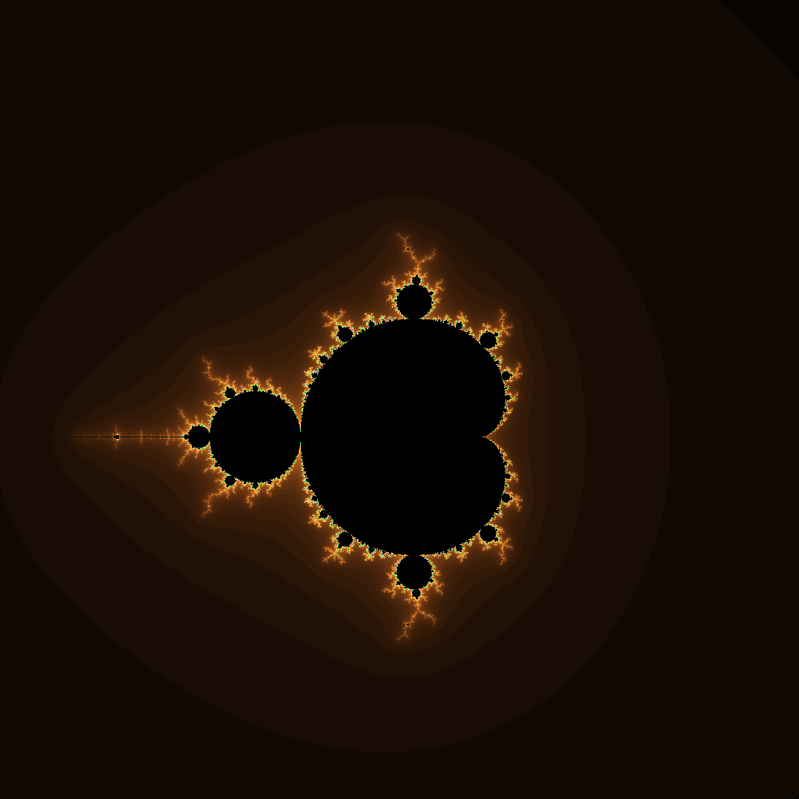
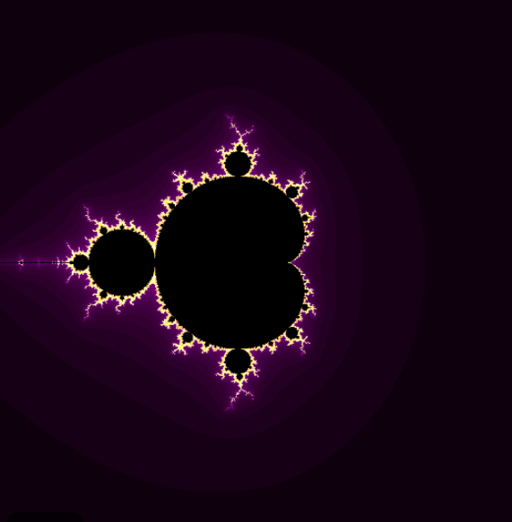
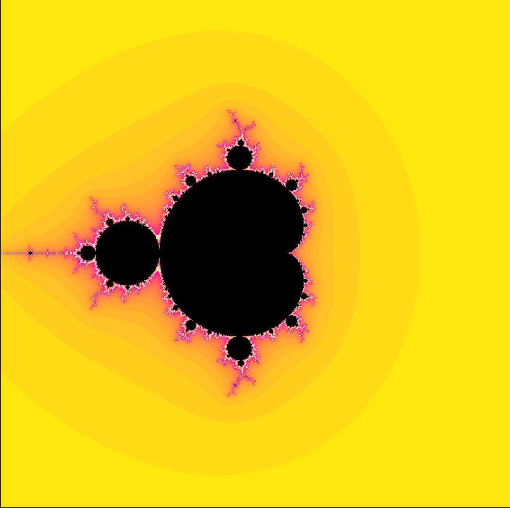
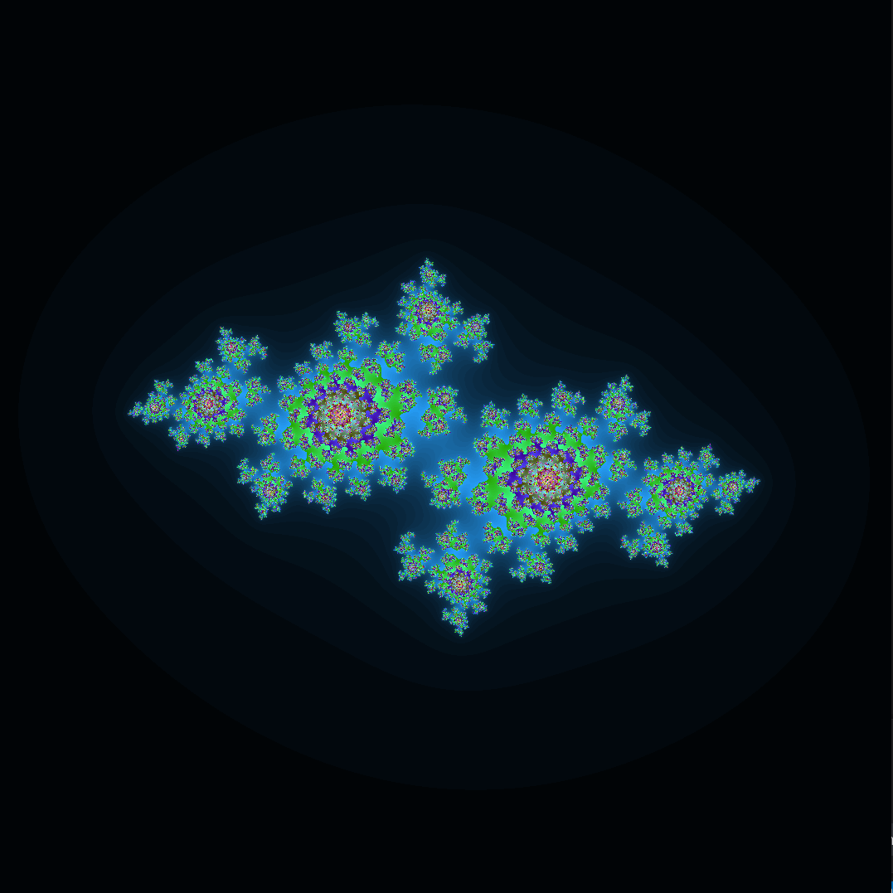
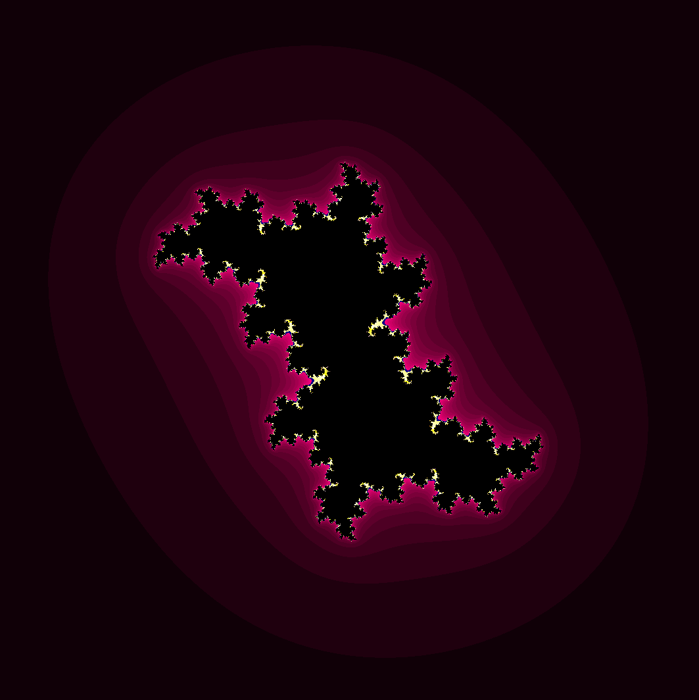
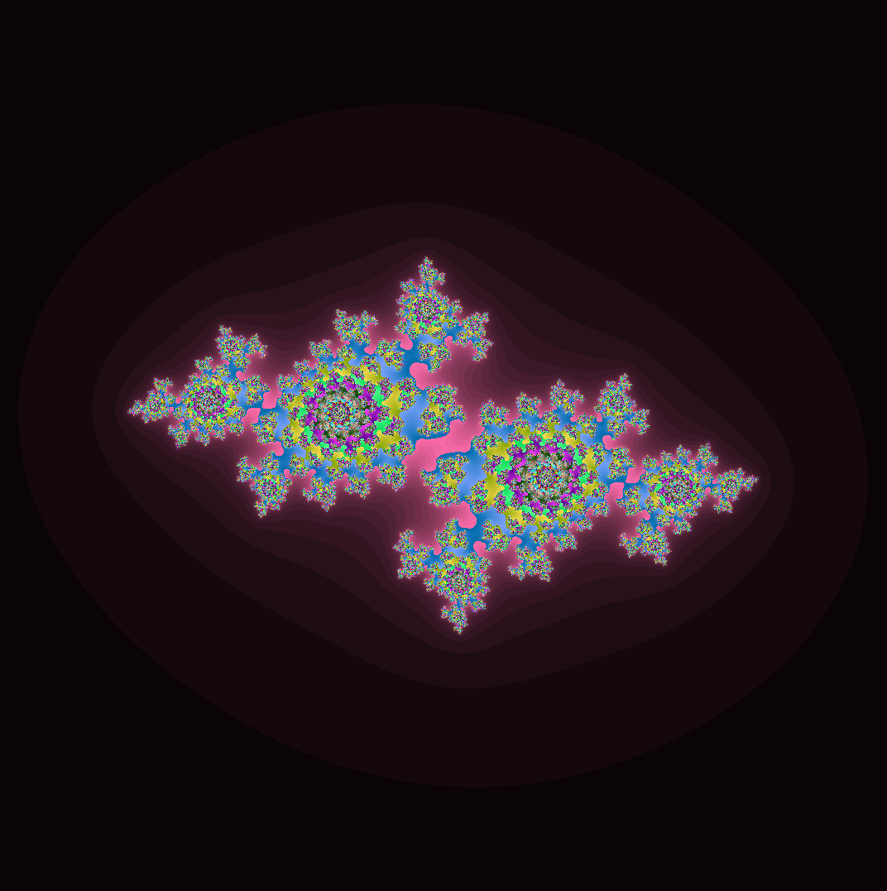
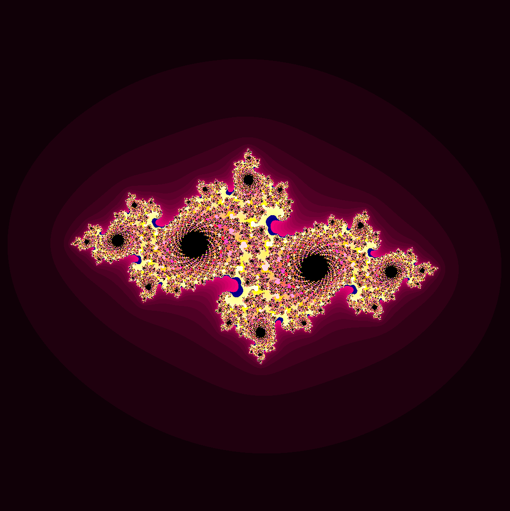
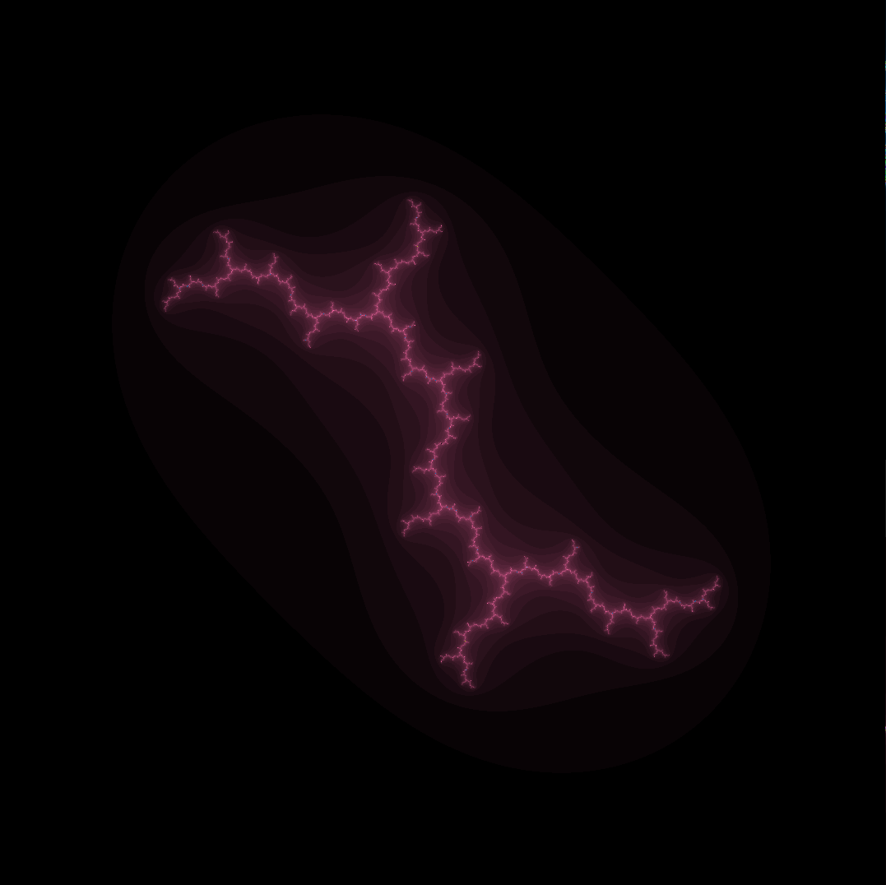

*This project has been created as part of the 42 curriculum by moabed*

## Description

A program named *fract'ol* designed to render two complex numbers equations, which are Julia and Mandlebrot sets , using minilibx library.

## Instructions

On the same project repository, open the terminal and prompt

- make

it will compile the project files and libraries into an executable named *fractol*

Then to test if mandlebrot set works prompt

- ./fractol mandlebrot

Or if you choose to test julia set

- ./fractol julia "real" "imaginary"

## Resources

1) fractol: render beautiful fractals in C (mandelbrot and julia set): https://youtu.be/ANLW1zYbLcs?si=Z_muin9mc6VFOOHg

2) Full guide to MiniLibX: https://harm-smits.github.io/42docs/libsminilibx/introduction.html

3) Mandlebrot Evil Twin: https://youtu.be/Ed1gsyxxwM0?si=0RRDOWV5eYrEr-Tu

4) Decoding Math’s Famed Fractal: The Mandelbrot Set : https://youtu.be/u9GAnW8xFJY?si=iV2nk4jJSfBB3qne

## AI Usage

In this project, AI was used wisely in error handling to check every case of failure, beside finding the optimal color equations to paint the sets , also explained for me the scaling method.

  

<i>Final result to Mandlebrot in purple</i>

<table>
  <tr>
    <td align="center">
      
       
      <b>Fire Orange</b>
    </td>
    <td align="center">
      
       
      <b>Cyan</b>
    </td>
    <td align="center">
      
       
      <b>Fire Orange</b>
    </td>
    <td align = "center">
    
       
      <b>Yellow</b>
    </td>
    
    
  </tr>
</table>

  

<i>Final result in Julia</i>

<table>
  <tr>
    <td align="center">
      
       
      <b>Fire Orange</b>
    </td>
    <td align="center">
      
       
      <b>Red Rose</b>
    </td>
    <td align="center">
      
       
      <b>Fire</b>
    </td>
    <td align="center">
      
       
      <b>Vein</b>
    </td>
  </tr>
</table>
